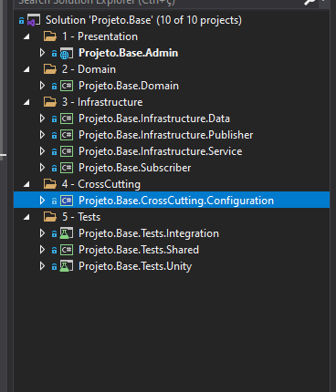
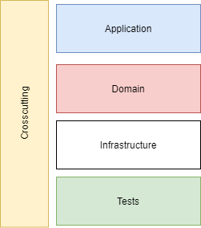
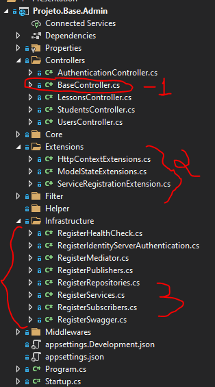
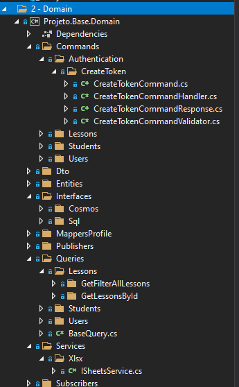
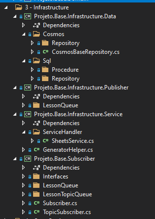
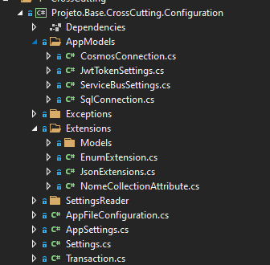
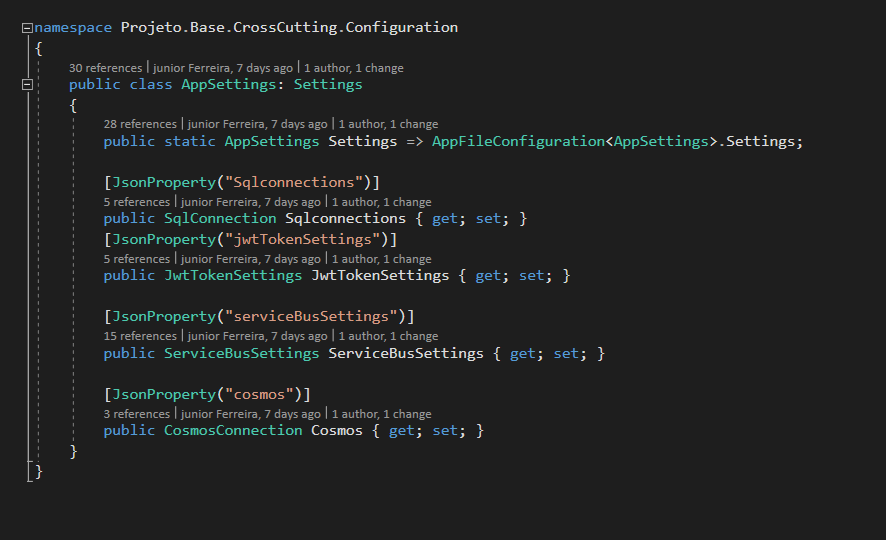
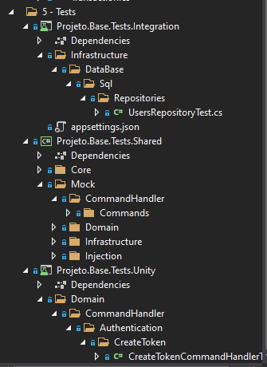

## Setup

### ArchType V2


### O que já existe ?
 - Dapper
 - FluentValidation
 - IdentityServer 4
 - Serilog
### O que há de novo

 - Arquitetura desacoplada utilizando conceitos ddd/cqrs 
 - Melhorias Swagger  para não precisar passar "bearer" em seu request deixando requisições padronizadas
 - Ideia de packages para ter apenas oque será usado ex: banco oracle / sql/cosmos - mensageria service bus
 - Testes de unidade xUnit com AAA (Arrange, Act, Assert)
 - Moq
 
 - Redis
 - Melhoria implementação httpRequest onde poderia dar problema de Http socket exception
 - Docker file
 ## Vantagens
 
 - Response padrão para todas futuras aplicações
 - Melhor visualização para possiveis manutenções
 - Menor acoplamento pensando em sistemas distribuidos além de utilizar redis ao invés de memoryCache
 
## Conhecendo sua estrutura




A proposta de estrutura é subdividida em 5 pastas
1. Presentation : onde de fato fica nossa aplicação seja ela api/function/windows service...
2. Domain : Toda a regra de negócio fica desacoplada nessa sessão, tendo nossos patterns cqrs/ddd/solid
3. Infrastructure: Toda comunicação externa  está associada a nossa infra seja elas:
	- banco de dados (não relacional ou relacional)
	- serviços externos como chamada api de CEP
	- consumir ou publicar eventos (serviceBus)
4. Crosscutting: toda dependencia que poderá ser  usado em qualquer uma das pastas ficaria acoplada diretamente na nossa pasta cross 
	ex:
	- AppSettings consumida em toda parte da aplicação
	- Extensios
	- Transaction
5. Tests: nela é contida nossos testes de unidade integração e compartilhamento
 
 
## Presentation



1. A proposta da v2 seria ter responses padronizados. Na imagem 1 todos os controllers extendendo do baseController para seus responses.
2. na pasta extensions toda extensão que será APENAS da api podemos cadastrar nessa pasta
3. na pasta de infrastructure onde registraremos toda nossa dependencia
 


Na estrutura do dominio temos nosso command onde possuimos nossa ação como no exemplo CreateToken e nele temos nosso comando e nosso handler (CreateTokenCommandHandler) assim como nossa validação comando
todas interfaces de banco de dados e services também seriam registrado em nosso 'domain'
- Toda consulta feita em nossa aplicação ficaria na pasta de queries e baseado em contextos e ação ex: lessons > GetLessonsById



Na camada de infraestrutura temos toda nossa camada de data, nossos publishers/ subscribers se houver, e serviços externos como a chamada de apis ou serviços de criação de planilha de excel/pdf,etc..
na nossa camada de data baseamos as pastas em contextos(bancos) e separações entre procedures e repositories, também temos como base poder criar packages nuget para a iteração com os nossos bancos 
Para os publishers sempre que publicarmos algo em um tópico ou fila utilizariamos esse contexto para tal.
Para os subscriber seguimos a mesma linha da camada de data onde poderiamos ter packages para extender nossas classes e de fato utilizar o que é proposto pelo 'framework'



Na camada cross também utilizando o conceito de packages temos nossas exceptions genéricas, ao serem usados devolveriamos o status code 'badRequest' com notificacoes
também é nela que setamos todo nosso settings que por obrigatoriedade teremos um padrão para a implementação.

## Padrão AppSettings



Junto com estruturação do nosso AppSettings colocamos todas nossas configurações em nossa classe de Settings

1 - exemplo pratico do appsettings.json


```

 "Cosmos": {
    "dbEndpoint": "https://dev-cosmosdb-rgconectcarapplicationdev.documents.azure.com:443/",
    "dbKey": "SBnsQp3rdTrwL8YGy579olu34GvmxKR0TqQCq8FewZAlm3IsbQuCVPszYQdwAEROIaPNs1b4CFJ6Y7J8vZdPBg==",
    "databaseName": "testejr"
  }

```

AppSettings.cs

```
 public class AppSettings: Settings
    {
        public static AppSettings Settings => AppFileConfiguration<AppSettings>.Settings;
       
        [JsonProperty("cosmos")]
        public CosmosConnection Cosmos { get; set; }
    }
```

CosmosConnection.cs

```
 public class CosmosConnection
    {
        [JsonProperty("dbEndpoint")]
        public string DbEndpoint { get; set; }
        [JsonProperty("dbKey")]
        public string DbKey { get; set; }
        [JsonProperty("databaseName")]
        public string DatabaseName { get; set; }
        [JsonProperty("collectionName")]
        public string CollectionName { get; set; }
    }
```



Para os tests utilizamos testes de integração podendo ser nossos services (caso seja criação de excel/xml/pdf) e nossos repositories
Nos Testes compartilhados seriam todos nossos mocks, injeções de dependencia caso necessário.
Nos testes de unidade testamos nosso scopo utilizando xunit com AAA (Arrange, Act, Assert).
